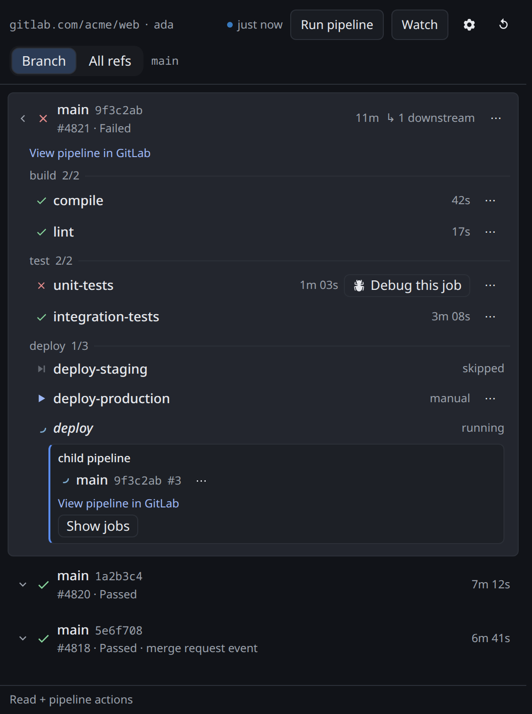
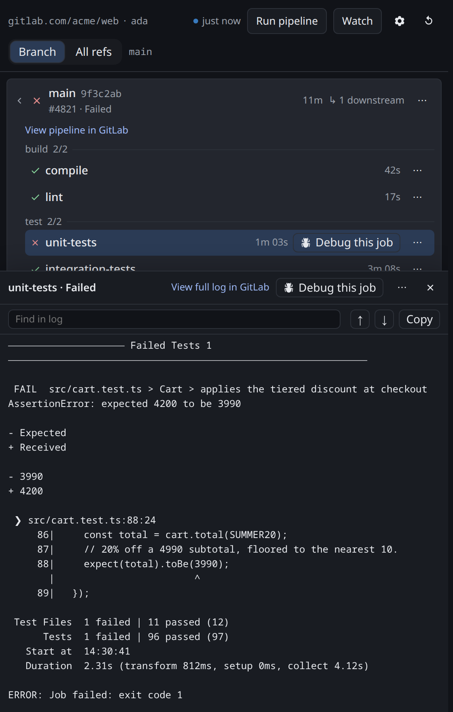

# <picture><source media="(prefers-color-scheme: dark)" srcset="icon-dark.svg"></picture> GitLab Pipelines for OpenChamber

An [OpenChamber](https://openchamber.dev) extension that shows the GitLab CI/CD Pipelines of the
project you have open — its Jobs by Stage, each Job's Trace in a log drawer, the Downstream pipelines
its Trigger jobs start, and the CI status of a Ref you watch — without leaving the workspace.



## Features

- **Pipelines and stages.** The Pipelines of the open project, newest first, for the current Ref or
  for all refs. Expand one into its Jobs by Stage, page back through older Pipelines with **Load
  more**, and watch the list update as a Pipeline runs — a freshness indicator and adaptive polling
  keep it live, and the panel pauses and explains itself when GitLab rate-limits it.
- **Log drawer.** Open any Job's Trace beside the list. Only the lines on screen are rendered, so even
  a very long Trace opens instantly; long lines wrap, **Find in log** (`Ctrl/Cmd+F`), **Jump to
  error** on a Trace that failed, and **Copy** puts the whole Trace on the clipboard.

  

- **Downstream pipelines.** A Trigger job's Downstream pipeline shows as a card beneath it, with its
  own Jobs by Stage — followed up to three generations below the root, and with a link to continue in
  GitLab beyond that.
- **Watch and notifications.** Watch one Ref per project and the Proxy service keeps checking it even
  while the panel is closed. A failed or canceled Pipeline raises a host toast and adds to a rail
  badge counting Unseen events; a success changes the badge only. A compact **Status section** in Work
  Status shows the watched Ref, its latest Status and the count, and toggles the watch.
- **Pipeline actions.** Retry, play, cancel or force-cancel a Job or Pipeline, and run a new Pipeline
  on the current Ref — each offered only when your Access token and project role allow it.
- **Debug this job.** Start an OpenChamber session seeded with a failed Job's identity, links and
  Trace tail, so an agent can investigate the failure in your open checkout.
- **Smart defaults.** The newest active Pipeline is expanded on load, your scope and expansion are
  remembered per project and Ref, and a Ref with no Pipelines falls back to all refs once with a
  dismissible notice and a **Back to branch** action.

## Install

The extension needs OpenChamber **1.22 or newer**. In OpenChamber, open **Settings → Extensions**,
paste this repository's URL into **Folder, ZIP, or URL**, and choose **Add**:

```
https://github.com/oroszgy/gitlab-pipelines-for-openchamber
```

Approve the permissions and **allow its Proxy service** — see [Security](#security); the icon then
appears on the rail, and a **Status section** joins Work Status. Installed from a git URL, it updates
itself: when the version bumps, the card shows **Update available**. Add a release tag to the URL to
pin one, for example `#v0.12.0`.

The built bundles (`panel/main.js`, `service/main.js` and `status/main.js`) ship in the repository,
because OpenChamber never compiles an extension. To run a checkout instead, build it and install the
folder — see [Development](#development).

## Configure

Open the panel and press the gear in its header. The form has three fields:

- **Configured host** — the GitLab instance to read, defaulting to `gitlab.com`. Enter a bare host
  (`gitlab.example.com`) or a full `https://` origin; a non-`https` origin, an embedded credential,
  or a path is refused. Clear it to return to `gitlab.com`.
- **Project override** — the GitLab project path (`group/subgroup/project`) to read when the open
  checkout's git remote cannot name one. Leave it empty to derive the project from the remote.
- **Access token** — a GitLab personal access token. Use the `read_api` scope to read pipelines; add
  the `api` scope if you also want the pipeline actions. It is a masked field, posted once, and never
  read back; once saved it shows only as *a token is saved*. Use **Clear token** to remove it.

One Access token is kept **per host**, so switching between `gitlab.com` and a self-managed instance
does not lose either token. The form's **Configured host** also decides `host-mismatch`: a project
whose remote points at another GitLab is reported rather than silently read.

A correct token is confirmed by the username shown in the panel header.

## Watch a Ref

Press **Watch** in the panel header, or **Watch** in the Status section, to watch the open project's
current Ref. The Proxy service then polls that Ref on its own, on a slower interval than the panel,
and records each Pipeline that settles — so a failure is noticed while you are working elsewhere or
have the panel closed. A failed or canceled Pipeline raises a host toast; a success only increments
the rail badge, which counts the events since you last looked. Open the visible panel to clear the
badge. **Watching** (or the Status section's toggle) clears the watch.

Watching is opt-in and one Ref per project; a watch that is set when your Proxy service predates the
feature is disabled with an explanation rather than failing.

## Security

- **The Proxy service is mandatory.** Every GitLab request goes through the extension's Proxy
  service, so the install asks you to grant it. Nothing is read from GitLab until it is granted; if
  it is not granted or fails to start, the panel points you at **Settings → Extensions**.
- **The token lives with the service, not the panel.** The sandboxed panel never receives the
  Access token; the service stores it in a `0600` file in your user config directory
  (`$XDG_CONFIG_HOME/gitlab-pipelines/config.json` on Linux, Application Support on macOS,
  `%APPDATA%` on Windows) and attaches it to each request itself. The token is never written to a
  log and is stripped from any returned body or error.
- **The service is local.** It binds loopback only and requires the host-issued bearer on every
  route, so nothing else on the machine can use it as an open relay. It talks `https` only, verifies
  TLS with no opt-out, and caps every response.
- **GitLab access is read-only unless your token allows actions.** The panel can retry, play, cancel
  and trigger Pipelines and Jobs, but only when the Access token has the `api` scope and your account
  has Developer or higher on the project; a `read_api` token never sees an action that can only fail.
  The service refuses every write method except `POST` under GitLab's `/api/v4/` prefix, so the token
  can only be used for GitLab's own API.
- **Watching polls on its own, but only while you ask it to.** With a watch set, the service polls
  that one Ref on a slowed, bounded interval; with no watch, it makes no unattended calls at all.
- **The one host action is starting an OpenChamber session** from a failed Job, in your open checkout.

## Notes

- The extension does **not** appear in **Settings → Integrations**; it declares no integration and
  has no Connect flow. Configuration is entirely in the panel's form.
- The panel follows a Pipeline's Trigger jobs into their Downstream pipelines, up to three
  generations, with a link to continue in GitLab beyond that.
- A Pipeline's Trigger jobs are counted in its stage totals, and a Trigger job's status is its
  Downstream pipeline's once that pipeline exists.

## Development

Development requires **[Bun](https://bun.sh) ≥ 1.3** — install, build and tests all run on it, and Node
alone will not work.

```sh
bun install
bun run build   # regenerates the committed panel/main.js, service/main.js and status/main.js
bun run check   # typecheck + build + tests
bun run test    # build + tests
```

The three bundles are generated by `bun run build` and committed, so the extension installs straight
from the repository. A source change must regenerate and commit them; the pre-commit hook rebuilds and
stages them for you. To iterate, point **Settings → Extensions** at this folder once, then rebuild and
reload the panel after each change.

## License

[MIT](LICENSE) © 2026 György Orosz.
